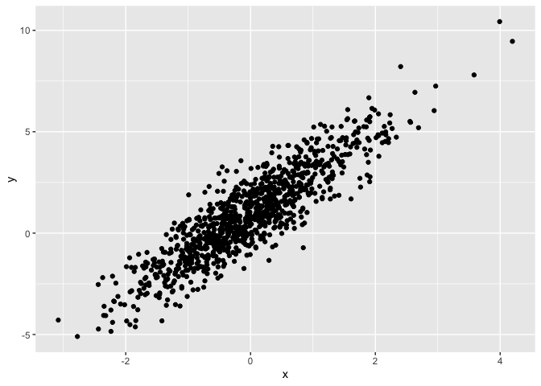

Simple document
================
2022-09-12

``` r
library(tidyverse)
```

I’m an R Markdown document! I’m making a change

# Section 1

Here’s a **code chunk** that samples from a *normal distribution*:

``` r
samp = rnorm(100)
length(samp)
```

    ## [1] 100

I can take the mean of the sample, too! The mean is 0.0373451.

<!-- -->

# Customize Code Chunks:

`eval = FALSE`: code will be displayed but not executed; results are not
included.

echo = FALSE: code will be executed but not displayed; results are
included.

include = FALSE: code won’t be executed or displayed.

message = FALSE and warning = FALSE: prevents messages and warnings from
being displayed.

results = hide and fig.show = hide: prevents results and figures from
being shown, respectively.

collapse = TRUE: output will be collapsed into a single block at shown
at the end of the chunk.

error: errors in code will stop rendering when FALSE; errors in code
will be printed in the doc when TRUE. The default is FALSE and you
should almost never change it.

dataframe comprised of: a numeric variable containing a random sample of
size 500 from a normal variable with mean 1; a logical vector indicating
whether each sampled value is greater than zero; and a numeric vector
containing the absolute value of each element. Then, produce a histogram
of the absolute value variable just created. Add an inline summary
giving the median value rounded to two decimal places.

``` r
df <- tibble(
x = rnorm(500, mean = 1),
y = (x > 0),
z = abs(x)
)


med = median(df$z)
```

The median of the absolute values is 1.03.

-   The mean of the sample is 0.9901548.
-   The median of the sample is 0.968757.
-   The standard deviation of the sample is 1.0250982.

# Formatting Text

## Text formatting

*italic* or *italic* **bold** or **bold** `code` superscript<sup>2</sup>
and subscript<sub>2</sub>

## Headings

# 1st Level Header

## 2nd Level Header

### 3rd Level Header

## Lists

-   Bulleted list item 1

-   Item 2

    -   Item 2a

    -   Item 2b

1.  Numbered list item 1

2.  Item 2. The numbers are incremented automatically in the output.

## Tables

| First Header | Second Header |
|--------------|---------------|
| Content Cell | Content Cell  |
| Content Cell | Content Cell  |

# YAML & Output Formats

author: “Jeff Goldsmith” date: 2019-09-10

output: html_document: toc: true toc_float: true

output: pdf_document: default

output: word_document: default
